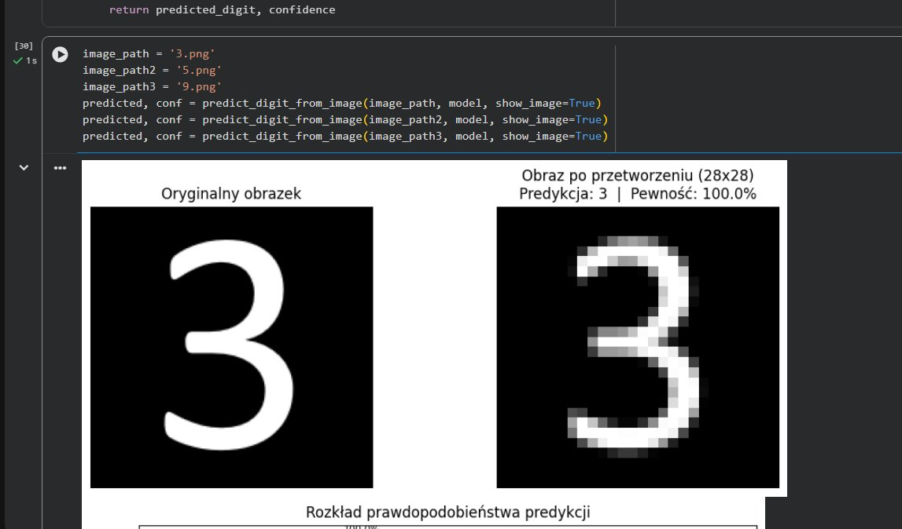
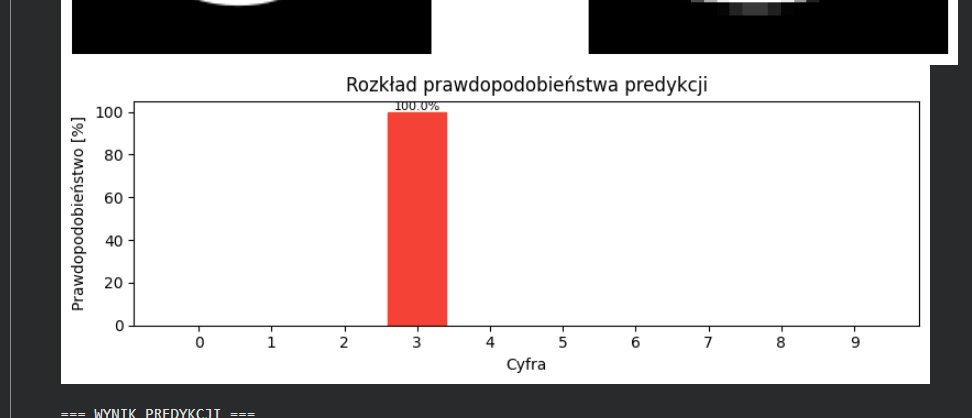
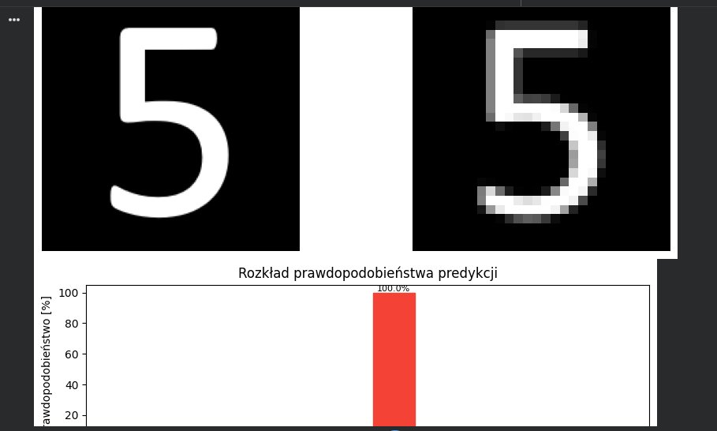
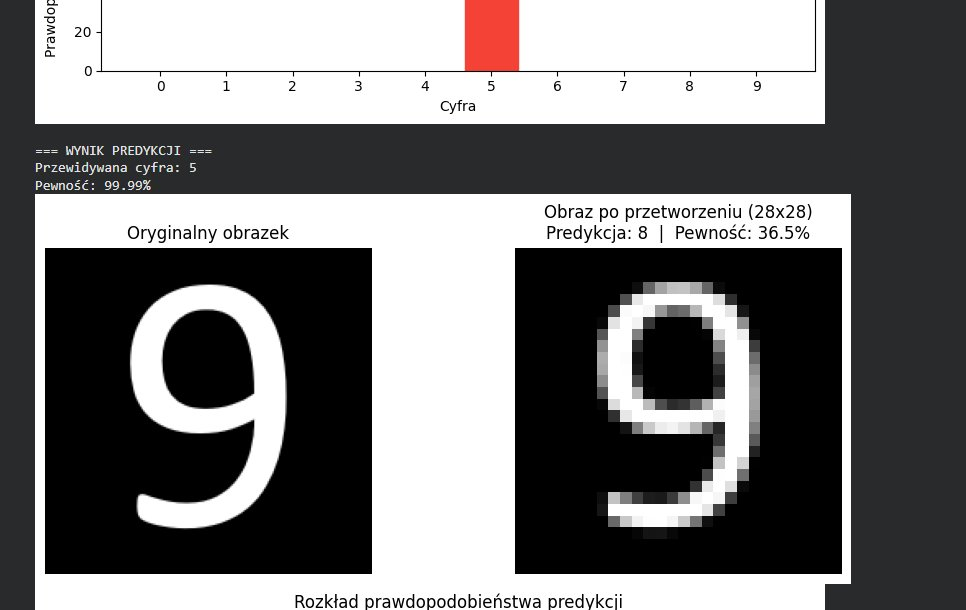
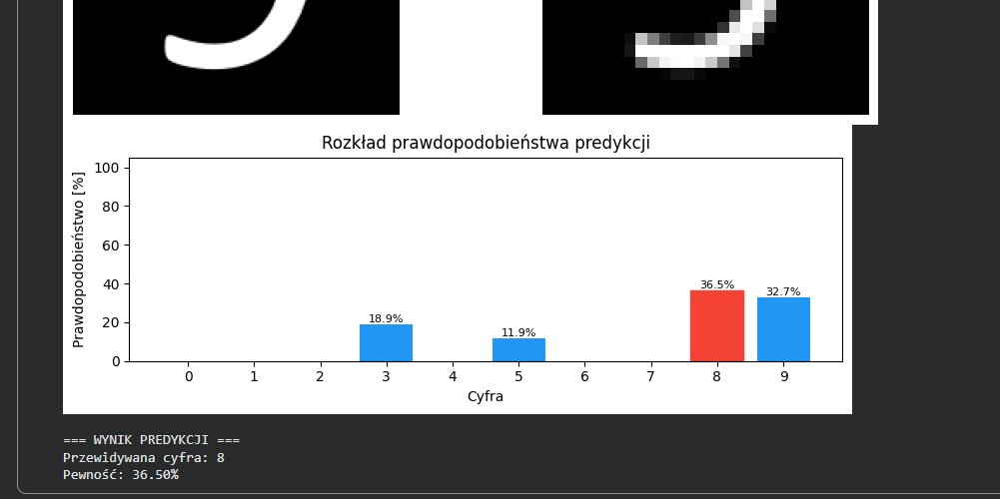
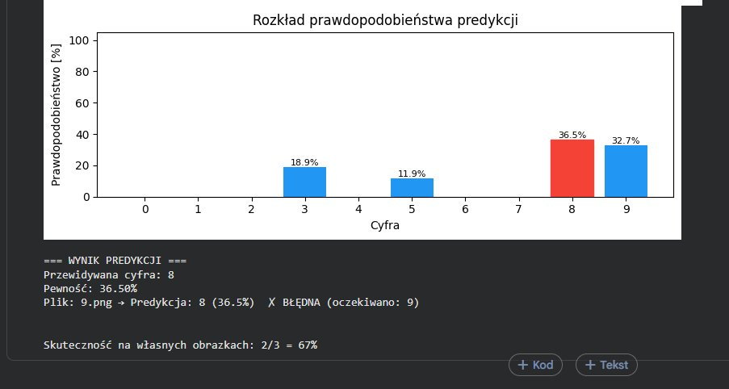

## 🔬 Laboratorium 3 - Klasyfikacja

Celem laboratorium było zbudowanie sieci neuronowej do rozpoznawania odręcznie pisanych cyfr na zbiorze danych **MNIST** oraz przetestowanie wytrenowanego modelu na własnych obrazkach.

---

### 1. Opis zbioru danych – MNIST

Zbiór MNIST zawiera **70 000 obrazów** (28×28 pikseli) z odręcznie pisanymi cyframi (0–9). Jest klasycznym benchmarkiem uczenia głębokiego, często nazywanym „Hello world" sieci neuronowych.

- **Dane treningowe:** 54 000 próbek  
- **Dane walidacyjne:** 6 000 próbek (10% zbioru treningowego)  
- **Dane testowe:** 10 000 próbek  

Dane zostały znormalizowane do zakresu [0, 1] poprzez podzielenie wartości pikseli przez 255.

---

### 2. Architektura modelu

Zbudowano sieć neuronową typu feedforward z dwiema ukrytymi warstwami:

```
Flatten(input_shape=(28, 28, 1))   → spłaszczenie obrazu 28x28 do wektora 784
Dense(50, activation='relu')       → warstwa ukryta 1
Dense(50, activation='relu')       → warstwa ukryta 2
Dense(10, activation='softmax')    → warstwa wyjściowa (10 klas)
```

- **Optymizator:** Adam  
- **Funkcja straty:** `sparse_categorical_crossentropy`  
- **Metryka:** accuracy  
- **Liczba epok:** max 30 (z mechanizmem `EarlyStopping`, patience=2)

---

### 3. Wyniki treningu i testu

Model osiągnął na zbiorze testowym:

| Metryka | Wynik |
| :---: | :---: |
| **Test accuracy** | **97.00%** |
| **Test loss** | **0.11** |

> Model został zatrzymany przez `EarlyStopping` przed osiągnięciem 30 epok – oznacza to, że strata walidacyjna przestała maleć i dalsze trenowanie nie przynosiło poprawy.

---

### 4. Zadanie – predykcja własnych obrazków

Zgodnie z instrukcją laboratoryjną, przy użyciu biblioteki **OpenCV** oraz metody `model.predict()`, przetestowano model na trzech własnoręcznie przygotowanych obrazkach cyfr: **3**, **5** i **9**.

---

#### Cyfra 3 – predykcja poprawna ✅

<p align="center">
  <br>
  <em>Oryginalny obrazek cyfry 3 oraz obraz po przetworzeniu do formatu 28×28. Model poprawnie rozpoznał cyfrę z pewnością 100%.</em>
</p>

<p align="center">
  <br>
  <em>Rozkład prawdopodobieństwa predykcji – model przypisał 100% pewności klasie „3". Brak jakichkolwiek wątpliwości klasyfikatora.</em>
</p>

---

#### Cyfra 5 – predykcja poprawna ✅

<p align="center">
  <br>
  <em>Obrazek cyfry 5 rozpoznany poprawnie z pewnością 99.99%. Obraz po przeskalowaniu do 28×28 zachował czytelną strukturę cyfry.</em>
</p>

---

#### Cyfra 9 – predykcja błędna ❌

<p align="center">
  <br>
  <em>Obrazek cyfry 9 – model błędnie sklasyfikował go jako cyfrę 8 z pewnością jedynie 36.5%. Po przeskalowaniu do 28×28 widać znaczną utratę szczegółów kształtu cyfry 9.</em>
</p>

<p align="center">
  <br>
  <em>Rozkład prawdopodobieństwa dla cyfry 9: model rozłożył pewność między kilka klas (8: 36.5%, 9: 32.7%, 3: 18.9%, 5: 11.9%), co wskazuje na niską pewność i błędną klasyfikację.</em>
</p>

---

### 5. Podsumowanie wyników własnych obrazków

<p align="center">
  <br>
  <em>Zbiorczy wynik predykcji na własnych obrazkach: skuteczność 2/3 = 67%.</em>
</p>

| Obrazek | Oczekiwana cyfra | Predykcja | Pewność | Wynik |
| :---: | :---: | :---: | :---: | :---: |
| `3.png` | 3 | 3 | 100.0% | ✅ Poprawna |
| `5.png` | 5 | 5 | 99.99% | ✅ Poprawna |
| `9.png` | 9 | 8 | 36.5% | ❌ Błędna |

**Skuteczność na własnych obrazkach: 2/3 = 67%**

---

### 6. Wnioski

Model osiągnął **97% skuteczności** na standardowym zbiorze testowym MNIST, co jest wynikiem bardzo dobrym dla prostej sieci feedforward bez konwolucji.

Na własnych obrazkach skuteczność wyniosła **67%** – cyfry 3 i 5 zostały rozpoznane bezbłędnie z niemal 100% pewnością, natomiast cyfra 9 sprawiła problem. Przyczyną błędu jest prawdopodobnie:

- styl pisma odbiegający od rozkładu MNIST (cyfra 9 wygląda podobnie do 8 po agresywnym przeskalowaniu do 28×28),
- utrata kluczowych cech kształtu podczas zmiany rozmiaru obrazu,
- brak augmentacji danych treningowych pod kątem własnoręcznych cyfr spoza zbioru.

> **Wniosek końcowy:** Sieć neuronowa sprawdza się bardzo dobrze na danych zbliżonych do zbioru treningowego (MNIST). Na danych z zewnątrz – np. własnych obrazkach – jakość predykcji może spaść, co pokazuje ograniczenia modelu bez dodatkowej regularyzacji lub rozszerzenia danych treningowych.
