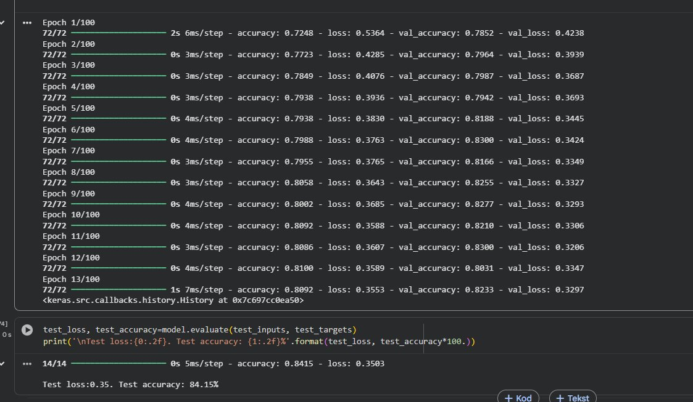

## 🔬 Laboratorium 4 - Praca z danymi

Celem laboratorium było zbudowanie modelu klasyfikacyjnego dla realnego biznesowego problemu — przewidywania, czy klient platformy z audiobookami **ponownie dokona zakupu** w ciągu 6 miesięcy. Jest to binarny problem klasyfikacji (0 = nie wróci, 1 = wróci).

---

### 1. Opis problemu i danych

Dane pochodzą z platformy sprzedającej audiobooki. Każdy rekord reprezentuje jednego klienta, który dokonał przynajmniej jednego zakupu. Zbiór zawiera ponad **14 000 rekordów** z 10 cechami wejściowymi:

| Kolumna | Opis |
| :--- | :--- |
| Book length (overall) | Łączna długość kupionych audiobooków (minuty) |
| Book length (avg) | Średnia długość kupionych audiobooków |
| Price (overall) | Łączna kwota wydanych pieniędzy |
| Price (avg) | Średnia kwota wydanych pieniędzy |
| Review | Czy klient zostawił opinię (0/1) |
| Review 10/10 | Ocena w skali 1–10 (brakujące uzupełnione średnią 8.91) |
| Minutes listened | Łączny czas przesłuchanych treści |
| Completion | Stopień ukończenia zakupionych treści |
| Support requests | Liczba zgłoszeń do supportu |
| Last visited minus purchase date | Różnica między ostatnią wizytą a pierwszym zakupem |

**Target:** 1 – klient wrócił i kupił ponownie w ciągu 6 miesięcy; 0 – nie wrócił.

---

### 2. Preprocessing danych (`SI_lab4.ipynb`)

Dane przed przekazaniem do modelu wymagały kilku kroków przygotowania:

**Balansowanie klas** — w surowych danych klasa 0 (nie wrócił) znacznie przeważa nad klasą 1. Nadmiarowe próbki klasy 0 zostały usunięte, tak aby obie klasy miały zbliżoną liczność (~50/50). Bez tego model trenowany na niezbalansowanym zbiorze uczy się głównie przewidywać klasę dominującą.

**Normalizacja** — dane wejściowe zostały znormalizowane metodą `preprocessing.scale()` z biblioteki `sklearn` (standaryzacja do średniej 0 i odchylenia 1). Jest to konieczne, ponieważ cechy mają bardzo różne zakresy wartości (np. minuty w tysiącach vs. wartości 0/1).

**Podział 80/10/10** — zbiór podzielono na:
- treningowy: 80% próbek
- walidacyjny: 10% próbek
- testowy: 10% próbek

Gotowe dane zapisano do plików `.npz`:
```
Audiobooks_data_train.npz
Audiobooks_data_validation.npz
Audiobooks_data_test.npz
```

Wyniki podziału:
```
Train:      3579 próbek | prop. kl. 1: ~50.2%
Validation:  447 próbek | prop. kl. 1: ~49.7%
Test:        448 próbek | prop. kl. 1: ~48.9%
```

---

### 3. Model sieci neuronowej (`SI_zad4_2_v2.ipynb`)

#### Architektura

```
Dense(100, activation='relu')    → warstwa ukryta 1
Dense(100, activation='relu')    → warstwa ukryta 2
Dense(2,   activation='softmax') → warstwa wyjściowa
```

- **Input size:** 10 (liczba cech)
- **Output size:** 2 (klasy: wróci / nie wróci)
- **Hidden layer size:** 100 neuronów
- **Optymizator:** Adam
- **Funkcja straty:** `sparse_categorical_crossentropy`
- **Batch size:** 100
- **Max epok:** 100 (z `EarlyStopping(patience=2)`)

#### Przebieg treningu i wynik końcowy

<p align="center">
  <br>
  <em>Przebieg treningu (13 epok, zatrzymany przez EarlyStopping) oraz wynik na zbiorze testowym: Test accuracy: 84.15%.</em>
</p>

Model zatrzymał się po 13 epokach — `EarlyStopping(patience=2)` wykrył, że strata walidacyjna przestała maleć. Accuracy na zbiorze walidacyjnym oscylowało w okolicach 82–83%, a na zbiorze testowym model osiągnął **84.15%**.

#### Wynik końcowy na zbiorze testowym

| Metryka | Wynik |
| :---: | :---: |
| **Test accuracy** | **84.15%** |
| **Test loss** | **0.35** |

---

### 4. Wnioski

Laboratorium pokazało pełny pipeline pracy z danymi biznesowymi w uczeniu maszynowym:

**Preprocessing jest kluczowy.** Bez balansowania klas i normalizacji model uczyłby się nieprawidłowo — dominująca klasa "zniekształcałaby" gradient, a różne skale cech spowalniałyby zbieżność.

**EarlyStopping chroni przed przeuczeniem.** Model zatrzymał się po 13 epokach, gdy strata walidacyjna przestała się poprawiać — mechanizm ten skutecznie zapobiega zapamiętywaniu danych treningowych.

**Wynik 84% na tym zbiorze jest poprawny.** Zbiór Audiobooks jest relatywnie trudny — dane są zaszumione, a wzorce zachowań klientów nie są w pełni liniowo separowalne. Wynik ~84% jest spójny z typowymi rezultatami dla prostej sieci feedforward na tym zbiorze danych.

> **Wniosek końcowy:** Model skutecznie identyfikuje klientów, którzy prawdopodobnie wrócą do platformy, co w praktyce biznesowej pozwala zoptymalizować wydatki na marketing — koncentrując budżet reklamowy na osobach z wysokim prawdopodobieństwem ponownego zakupu.
