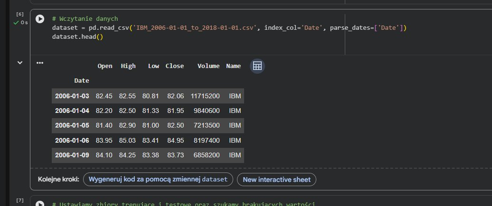
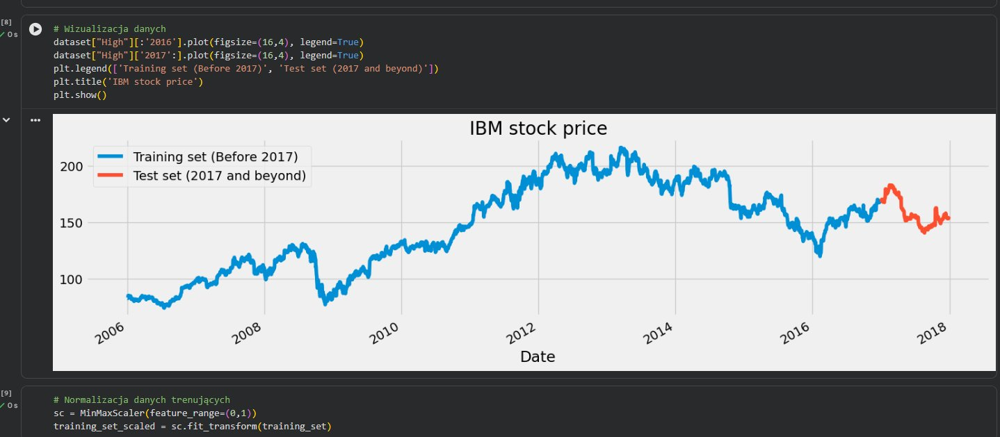
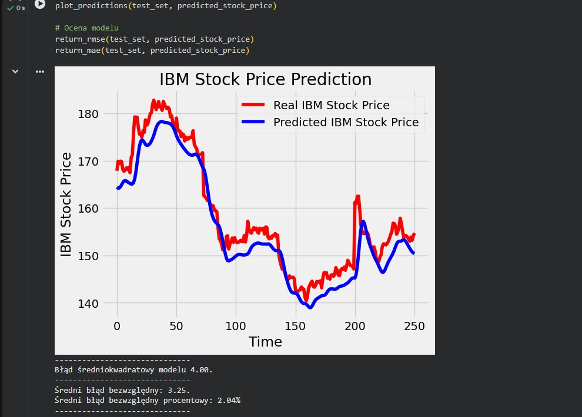
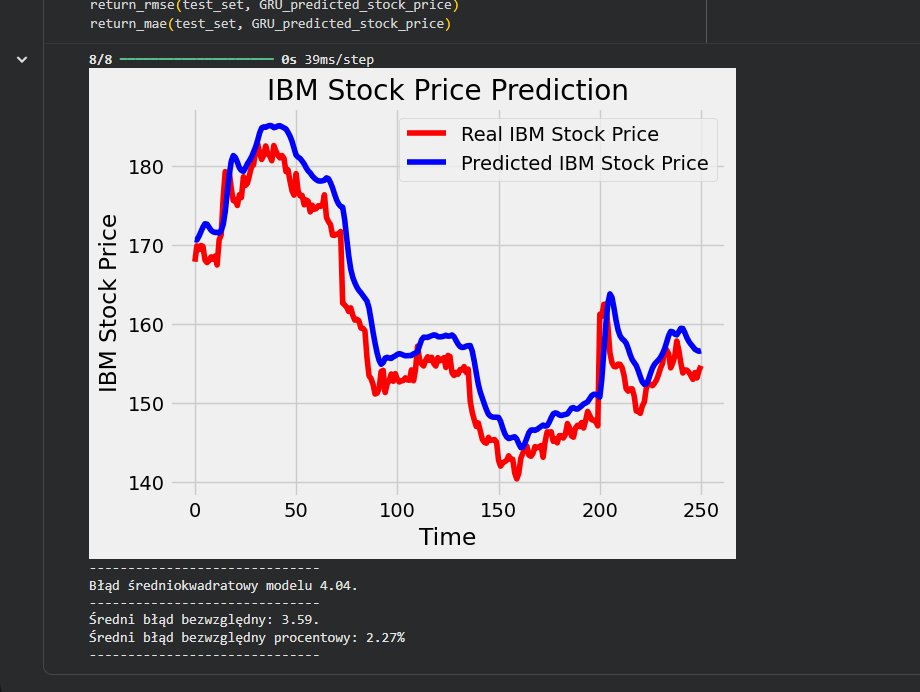
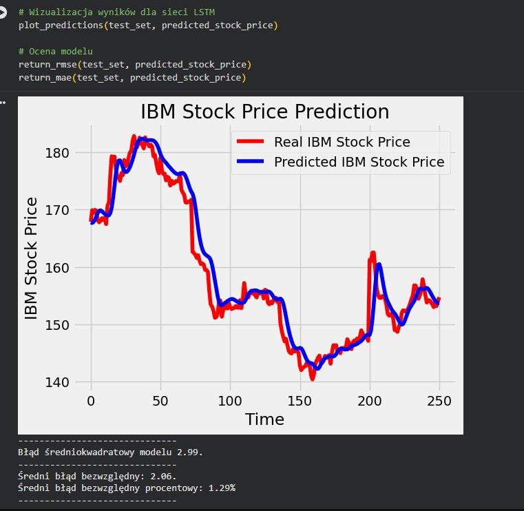
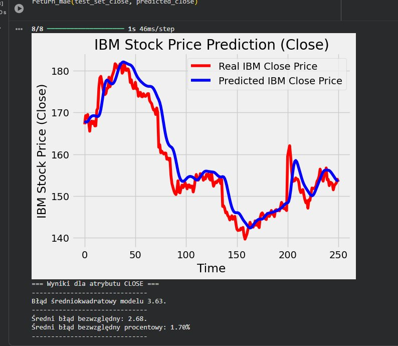
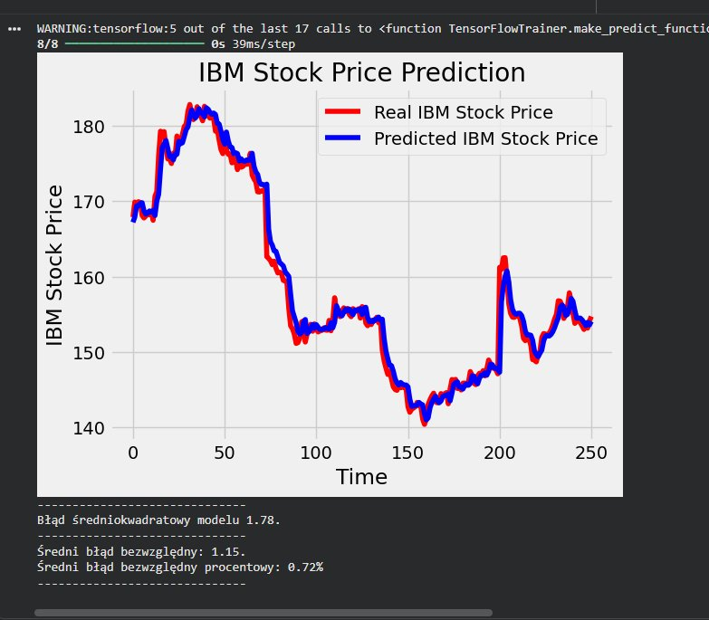

## 🔬 Laboratorium 5 - LSTM, GRU - regresja

Celem laboratorium było zbudowanie rekurencyjnych sieci neuronowych (RNN) z bramkami **LSTM** i **GRU** do predykcji cen akcji IBM. Dane treningowe obejmują lata 2006–2016, dane testowe – rok 2017. Do predykcji użyto atrybutu `High` (domyślnie) oraz `Close` (eksperyment D).

---

### 1. Opis danych

<p align="center">
  <br>
  <em>Wczytanie danych z pliku IBM_2006-01-01_to_2018-01-01.csv. Dane zawierają kolumny: Open, High, Low, Close, Volume.</em>
</p>

<p align="center">
  <br>
  <em>Wizualizacja zbioru treningowego (niebieski, lata 2006–2016) i testowego (czerwony, rok 2017). Widoczny jest trend wzrostowy do 2013 r. i spadkowy od 2014 r.</em>
</p>

Dane zostały znormalizowane metodą `MinMaxScaler` do zakresu [0, 1]. Zbudowano strukturę sekwencji z **60 krokami czasowymi** — każda próbka wejściowa zawiera 60 poprzednich notowań.

---

### 2. Modele bazowe (rmsprop + MSE, units=50)

Przed optymalizacją uruchomiono bazowe wersje obu architektur:

| Model | RMSE | MAE | MAPE |
| :---: | :---: | :---: | :---: |
| **LSTM bazowy** | 4.00 | 3.25 | 2.04% |
| **GRU bazowy** | 4.04 | 3.59 | 2.27% |

<p align="center">
  <br>
  <em>LSTM bazowy: optimizer=rmsprop, loss=MSE, units=50, epochs=50. RMSE=4.00, MAE=3.25, MAPE=2.04%.</em>
</p>

<p align="center">
  <br>
  <em>GRU bazowy: optimizer=rmsprop, loss=MSE, units=50, Early Stopping(loss). RMSE=4.04, MAE=3.59, MAPE=2.27%.</em>
</p>

---

### 3. Eksperymenty A–E: optymalizacja modelu LSTM

Wprowadzono następujące zmiany względem bazowego LSTM:

- **[A]** `units=100` zamiast 50 — większa pojemność modelu
- **[B]** `optimizer='adam'` zamiast rmsprop — szybsza i stabilniejsza zbieżność
- **[C]** `loss='huber'` zamiast MSE — odporność na wartości odstające (nagłe krachy giełdowe)
- **[E]** `EarlyStopping(monitor='val_loss', patience=5)` + `validation_split=0.1` — właściwsze monitorowanie na zbiorze walidacyjnym zamiast treningowym

<p align="center">
  <br>
  <em>LSTM po optymalizacji (units=100, Adam, Huber, EarlyStopping val_loss): RMSE=2.99, MAE=2.06, MAPE=1.29%. Widoczna znaczna poprawa dopasowania niebieskiej linii do czerwonej.</em>
</p>

| Metryka | LSTM bazowy | LSTM zoptymalizowany |
| :---: | :---: | :---: |
| **RMSE** | 4.00 | **2.99** |
| **MAE** | 3.25 | **2.06** |
| **MAPE** | 2.04% | **1.29%** |

> Zmiana optimizera na Adam i funkcji straty na Huber przyniosła największą poprawę — RMSE spadło o ~25%.

---

### 4. Eksperyment D – predykcja atrybutu `Close` zamiast `High`

<p align="center">
  <br>
  <em>Model LSTM dla atrybutu Close: RMSE=3.63, MAE=2.68, MAPE=1.70%. Wynik gorszy niż dla High — atrybut Close jest bardziej zaszumiony.</em>
</p>

| Atrybut | RMSE | MAE | MAPE |
| :---: | :---: | :---: | :---: |
| **High** | 2.99 | 2.06 | 1.29% |
| **Close** | 3.63 | 2.68 | 1.70% |

> Predykcja atrybutu `High` okazała się dokładniejsza — wartości `High` są bardziej „gładkie" i mniej podatne na szum śróddzienny niż `Close`.

---

### 5. Eksperyment F+G – finalny model GRU (RMSE < 2.0)

Zastosowano architekturę GRU z pełną optymalizacją: `units=100`, `optimizer='adam'`, `loss='huber'`, `EarlyStopping(monitor='val_loss', patience=5)`.

<p align="center">
  <br>
  <em>Finalny model GRU: RMSE=1.78, MAE=1.15, MAPE=0.72%. Cel RMSE &lt; 2.0 osiągnięty. Niebieska linia predykcji niemal pokrywa się z rzeczywistymi cenami.</em>
</p>

| Metryka | GRU bazowy | GRU finalny |
| :---: | :---: | :---: |
| **RMSE** | 4.04 | **1.78** ✅ |
| **MAE** | 3.59 | **1.15** |
| **MAPE** | 2.27% | **0.72%** |

> **Cel F spełniony: RMSE = 1.78 < 2.0**

---

### 6. Podsumowanie porównania wszystkich konfiguracji

| Konfiguracja | Architektura | Optimizer | Loss | RMSE | MAE |
| :--- | :---: | :---: | :---: | :---: | :---: |
| Bazowy | LSTM | rmsprop | MSE | 4.00 | 3.25 |
| Bazowy | GRU | rmsprop | MSE | 4.04 | 3.59 |
| Zoptymalizowany | LSTM | Adam | Huber | 2.99 | 2.06 |
| Close (D) | LSTM | Adam | Huber | 3.63 | 2.68 |
| **Finalny ✅** | **GRU** | **Adam** | **Huber** | **1.78** | **1.15** |

---

### 7. Wnioski

**[A] Liczba jednostek ma duże znaczenie.** Zwiększenie `units` z 50 do 100 poprawia zdolność modelu do uczenia się złożonych wzorców czasowych, kosztem dłuższego treningu.

**[B] Adam vs RMSprop.** Adam okazał się lepszym optymalizatorem dla tego zadania — szybciej zbiega i osiąga niższy błąd końcowy. RMSprop jest dobrym punktem startowym, ale Adam go tu przewyższa.

**[C] Huber > MSE dla danych giełdowych.** Funkcja Huber jest odporna na wartości odstające (nagłe krachy/wzrosty), przez co model nie jest "karany" nieproporcjonalnie za pojedyncze anomalie — w przeciwieństwie do MSE, które podnosi błędy do kwadratu.

**[D] High vs Close.** Atrybut `High` jest łatwiejszy do predykcji niż `Close` — wartości dzienne maksima są bardziej przewidywalne niż ceny zamknięcia.

**[E] EarlyStopping na val_loss.** Monitorowanie straty walidacyjnej zamiast treningowej lepiej chroni przed przeuczeniem — model zatrzymuje się gdy naprawdę przestaje generalizować, a nie tylko gdy przestaje dopasowywać dane treningowe.

**[G] Najlepsza konfiguracja:**
```
Architektura: GRU (4 warstwy, units=100, Dropout=0.2)
Optimizer:    Adam
Loss:         Huber
EarlyStopping: monitor='val_loss', patience=5
Epochs:       100 (z early stopping)
Batch size:   32
```
GRU z tą konfiguracją osiągnął **RMSE=1.78** i **MAPE=0.72%**, co oznacza że model myli się średnio o mniej niż 1% wartości akcji. GRU trenuje się szybciej niż LSTM przy porównywalnej lub lepszej dokładności, co czyni go bardziej praktycznym wyborem dla predykcji szeregów czasowych.
